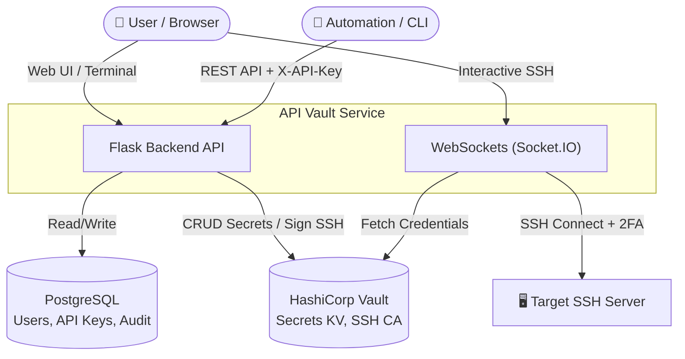

# API Vault 🔐

> **Hệ thống quản lý thông tin đăng nhập server và API key tích hợp HashiCorp Vault**

## Tính năng

| Tính năng | Mô tả |
|-----------|-------|
| 🔐 **Authentication** | JWT login + API Key (X-API-Key header) |
| 🗝️ **Secret Storage** | Lưu trữ thông tin login server (SSH/password/token/key) vào Vault KV v2 |
| 🔑 **API Key Management** | Generate, revoke, rotate keys với phân quyền scope |
| 💻 **SSH Certificates** | Ký SSH key qua Vault SSH CA, download bundle |
| 🌐 **Web Terminal** | Giao diện Console (Tab riêng), kết nối SSH trực tiếp trên trình duyệt, hỗ trợ Auto-fill 2FA/TOTP |
| 📦 **KeePass Import** | Import hàng loạt Server credentials từ file `.kdbx` bằng Background job |
| 👥 **User Management** | CRUD users với phân quyền admin |
| 📋 **Audit Logs** | Ghi lại toàn bộ thao tác nhạy cảm |
| 🖥️ **Web Dashboard** | Giao diện quản lý dark mode, hỗ trợ quét QR TOTP, Upload file SSH key, Filter/Sort danh sách thông minh |
| 📖 **Swagger UI** | API documentation tại `/apidocs` |

## Kiến trúc Hệ thống (Architecture Diagram)




## Triển khai trên máy mới (Deployment)

Nếu bạn mang source code này sang chạy ở một máy chủ / máy tính khác, bạn có thể thiết lập nhanh theo các bước sau:

### 1. Chuẩn bị môi trường

```bash
# Clone hoặc copy thư mục source code sang máy mới
cd /path/to/Api_Vault

# Cấp quyền thực thi cho script setup
chmod +x setup.sh

# Tạo file .env từ template (và cấu hình lại IP/Port nếu cần)
cp .env.example .env
nano .env 
```

### 2. Chạy tự động bằng `setup.sh`

File `setup.sh` đã được cấu hình sẵn để tự động tạo môi trường ảo (venv), cài đặt thư viện `requirements.txt`, và khởi động các thành phần phụ trợ (như Vault).

```bash
./setup.sh
```

### 3. Khởi tạo Database (chỉ làm 1 lần ở máy mới nếu chưa có DB)

```bash
source venv/bin/activate
flask db upgrade
```

### 4. Chạy ứng dụng

```bash
source venv/bin/activate
python run.py
```

Hoặc dùng Docker:

```bash
# Chỉ chạy PostgreSQL và  Vault (nếu chưa có)
docker compose up -d postgres  vault  vault-init

# Chạy toàn bộ
docker compose up -d
```

## API Endpoints

### Authentication

| Method | Endpoint | Mô tả |
|--------|----------|-------|
| `POST` | `/api/v1/auth/login` | Đăng nhập → JWT token |
| `POST` | `/api/v1/auth/refresh` | Làm mới access token |
| `POST` | `/api/v1/auth/logout` | Đăng xuất |
| `GET`  | `/api/v1/auth/me` | Thông tin user hiện tại |
| `POST` | `/api/v1/auth/change-password` | Đổi mật khẩu |

### API Keys

| Method | Endpoint | Mô tả |
|--------|----------|-------|
| `GET`  | `/api/v1/keys` | Danh sách API keys |
| `POST` | `/api/v1/keys` | Tạo API key mới |
| `DELETE` | `/api/v1/keys/<id>` | Thu hồi key |
| `POST` | `/api/v1/keys/<id>/rotate` | Xoay vòng key |
| `GET`  | `/api/v1/keys/scopes` | Danh sách scopes |

### Secrets (Server Credentials)

| Method | Endpoint | Mô tả |
|--------|----------|-------|
| `GET`  | `/api/v1/secrets` | Liệt kê tất cả secrets |
| `POST` | `/api/v1/secrets` | Tạo secret mới |
| `GET`  | `/api/v1/secrets/<slug>` | Lấy chi tiết secret |
| `PUT`  | `/api/v1/secrets/<slug>` | Cập nhật secret |
| `DELETE` | `/api/v1/secrets/<slug>` | Xóa secret |

### SSH Certificates

| Method | Endpoint | Mô tả |
|--------|----------|-------|
| `POST` | `/api/v1/ssh/sign` | Generate + sign SSH key |
| `POST` | `/api/v1/ssh/sign-existing` | Sign public key có sẵn |
| `GET`  | `/api/v1/ssh/download/<file>` | Download SSH key files |

### Admin

| Method | Endpoint | Mô tả |
|--------|----------|-------|
| `GET`  | `/api/v1/admin/users` | Quản lý users |
| `GET`  | `/api/v1/admin/audit-logs` | Xem audit logs |
| `GET`  | `/api/v1/admin/health` | Health check |
| `GET`  | `/api/v1/admin/stats` | Thống kê hệ thống |

## Cách sử dụng

### Đăng nhập lấy JWT

```bash
curl -X POST http://localhost:5055/api/v1/auth/login \
  -H "Content-Type: application/json" \
  -d '{"username": "admin", "password": "Admin@123456"}'
```

### Tạo API Key

```bash
curl -X POST http://localhost:5055/api/v1/keys \
  -H "Authorization: Bearer <jwt_token>" \
  -H "Content-Type: application/json" \
  -d '{
    "name": "my-automation-key",
    "scopes": ["secrets:read", "ssh:sign"]
  }'
```

### Lưu thông tin server

```bash
curl -X POST http://localhost:5055/api/v1/secrets \
  -H "X-API-Key: vk_..." \
  -H "Content-Type: application/json" \
  -d '{
    "name": "prod-web-01",
    "host": "192.168.1.10",
    "port": 22,
    "username": "root",
    "auth_type": "password",
    "password": "my-server-password",
    "description": "Production web server",
    "tags": ["prod", "web"]
  }'
```

### Sign SSH Key

```bash
curl -X POST http://localhost:5055/api/v1/ssh/sign \
  -H "X-API-Key: vk_..." \
  -H "Content-Type: application/json" \
  -d '{
    "server": "192.168.1.10",
    "user": "root",
    "ttl": "1h"
  }'
```

## API Key Scopes

| Scope | Quyền |
|-------|-------|
| `secrets:read` | Đọc thông tin server |
| `secrets:write` | Tạo/cập nhật thông tin server |
| `secrets:delete` | Xóa thông tin server |
| `ssh:sign` | Ký SSH key qua Vault CA |
| `keys:manage` | Quản lý API keys (chỉ admin) |
| `audit:read` | Xem audit logs |

## Cấu trúc project

```
Api_Vault/
├── app/
│   ├── __init__.py          # Flask app factory
│   ├── config.py            # Cấu hình
│   ├── extensions.py        # Flask extensions
│   ├── models/
│   │   ├── user.py          # User model
│   │   ├── api_key.py       # API Key model
│   │   └── audit_log.py     # Audit Log model
│   ├── routes/
│   │   ├── auth.py          # Authentication
│   │   ├── api_keys.py      # API key management
│   │   ├── secrets.py       # Secret CRUD
│   │   ├── ssh.py           # SSH certificate signing
│   │   ├── admin.py         # Admin endpoints
│   │   └── import_kdbx.py   # Background worker import .kdbx
│   ├── middleware/
│   │   └── auth_guard.py    # JWT + API Key auth middleware
│   ├── utils/
│   │   └── vault_client.py  # HashiCorp Vault client
│   └── sockets.py           # WebSockets (Terminal SSH & Background Jobs)
├── static/
│   ├── index.html           # Web Dashboard
│   ├── terminal.html        # Web SSH Console (Full tab)
│   ├── css/style.css
│   └── js/app.js
├── migrations/              # DB migrations
├── requirements.txt
├── .env.example
├── docker-compose.yml
├── Dockerfile
├── alembic.ini
└── run.py
```

## Default credentials

> **Username:** `admin`
> **Password:** `Admin@123456`

⚠️ Đổi ngay trong `.env` trước khi deploy production!
